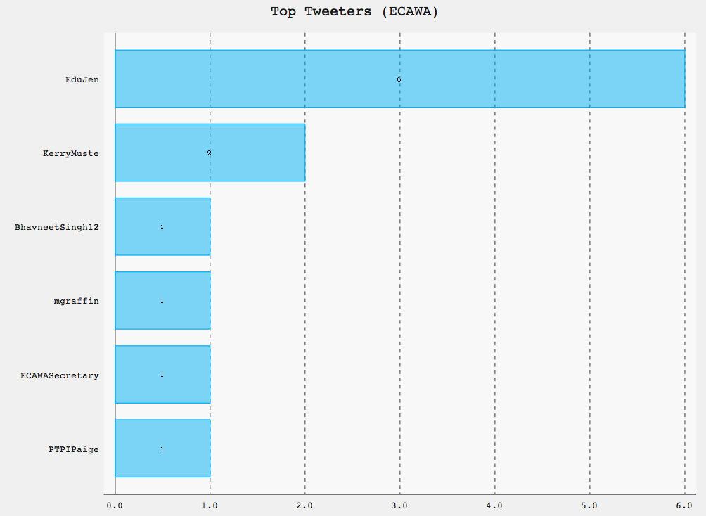
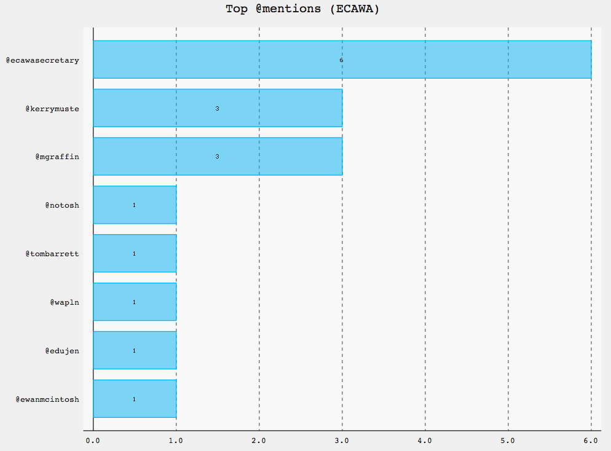
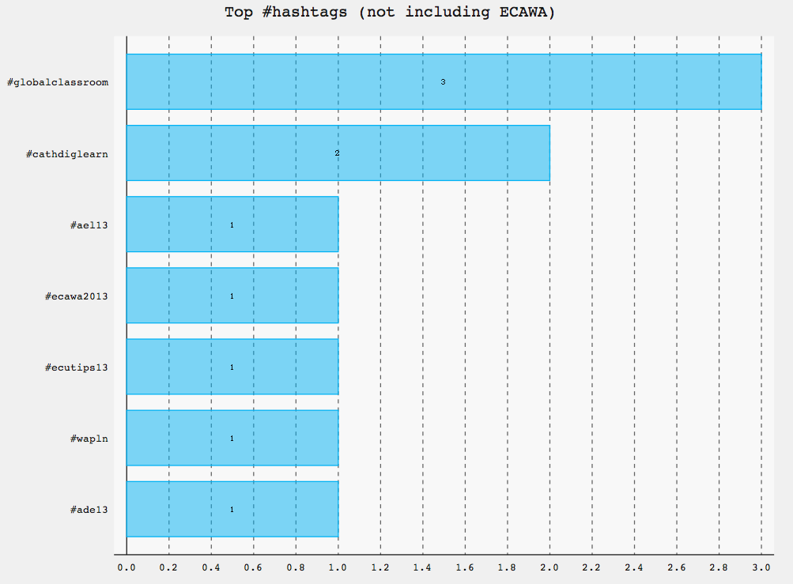
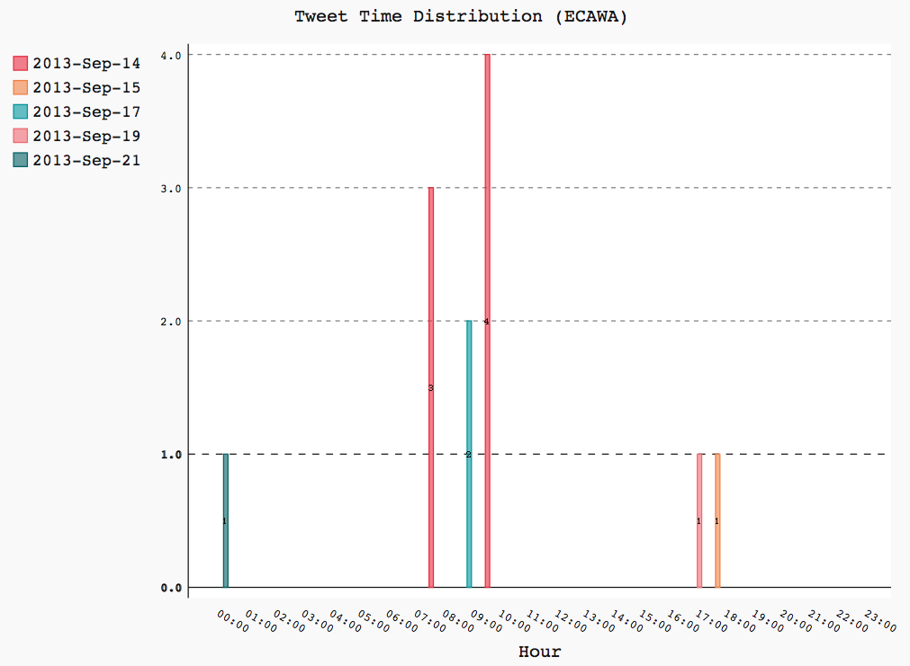

# toots.py #

## Backstory ##
This is a short Python script which grew out of a session at the ACEC2012
conferece for technology in education where analysis was being given on the
use of Twitter as a back-channel. It sounded like the number crunching and
organisation of data was pretty tedious so I figured I'd write a bit of code
to look at the problem myself.

It started out pretty rough and depended on third party websites for the Twitter search and output data to CSV so I had to generate charts by hand. That sucked. The current version is much nicer.

## What it does ##
The script uses the Twitter API (requires an API key, batteries not included) and the [TwitterSearch Python wrapper](https://github.com/ckoepp/TwitterSearch) to search for a set of specified terms. The tweets which have been seen are stored in a SQLite3 table for later processing. This is mainly so that I could collect data over a series of days, since Twitter stops giving older search results pretty quickly.

When I have enough data for display I can generate a series of charts.
Current it generates:

- list of tweeter IDs and number of tweets
- list of @mentions and number of times mentioned
- list of #hashtags and number of times tweeted
- time distribution (broken down by date and hour)

## Usage ##
### Sample code ###

```python
from toots import *

db = TootsDB()
keywords = ["ECAWA"]
# harvest mode
db.get_new_tweets(keywords)
# process mode
t = db.retrieve("ECAWA")
tooter = Toots("ECAWA",t)
tooter.build_tweeters('test_tweeters.svg')
tooter.build_mentions('test_mentions.svg')
tooter.build_hashtags('test_hashtags.svg')
tooter.build_timeline('test_timeline.svg')
```

### Sample output ###
For a very small set of data using the above code, this produces the following charts:






(Apologies for the PNGs when this produces SVGs, but Github doesn't like showing them. Also in a separate issue, why is OSX so terrible for converting SVG->PNG? The only tools either seem to be crap or require X11/XQuartz.)
  
## Dependencies ##
Currently this script depends on:

- [TwitterSearch](https://github.com/ckoepp/TwitterSearch) for access to the Twitter API
- [pygal](http://pygal.org) for graph generation (which in turn depends on [lxml](http://lxml.de/))

## TODO ##
The todo list currently stands at:

- Bolt this onto something like Tornado so that I can query stuff in close to real time (the graph generation stuff already supports this since it can write to file for periodic use or return SVG code to dump directly into a webpage)
- Fix up potential breakage. At the moment it doesn't do a lot of exception handling or graceful exits.
- Config for people not me isn't really there yet. There are a number of assumptions about stuff like timezone (since Twitter returns tweet times at +00:00), and the API key stuff should probably be loaded from a file rather than being hard coded.
